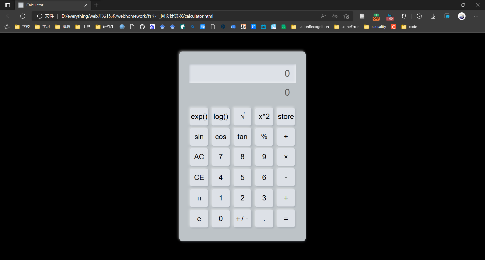

# 作业1_网页计算器

运行结果如下图所示：



## HTML

```html
<div class="calculator">
        <form action="#" id="form">
            <!-- 定义显示数字和暂存器的部分 -->
            <div class="result">
                <input type="text" id="disp" value="0" onkeypress="displayResult(event)">
                <input type="text" id="temptext" value="0">
            </div>
            <!-- 定义计算器的按钮 -->
            <div class="buttons">
                <div>
                    <input type="button" value="exp()" onclick="expFunc()">
                    <input type="button" value="log()" onclick="logFunc()">
                    <input type="button" value="√" onclick="sqrtFunc()">
                    <input type="button" value="x^2" onclick="squareFunc()">
                    <input type="button" id="savevalue" value="store" onclick="saveFunc()">
                </div>
                <div>
                    <input type="button" value="sin" onclick="sinFunc()">
                    <input type="button" value="cos" onclick="cosFunc()">
                    <input type="button" value="tan" onclick="tanFunc()">
                    <input type="button" value="%" onclick="percentage()">
                    <input type="button" value="÷" onclick="oprt('/')"> 
                </div>
                <div>
                    <input type="button" value="AC" onclick="val('ac')">
                    <input type="button" value="7" onclick="val('7')">
                    <input type="button" value="8" onclick="val('8')">
                    <input type="button" value="9" onclick="val('9')">
                    <input type="button" value="×" onclick="oprt('*')"> 
                </div>
                <div>
                    <input type="button" value="CE" onclick="clearone()">
                    <input type="button" value="4" onclick="val('4')">
                    <input type="button" value="5" onclick="val('5')">
                    <input type="button" value="6" onclick="val('6')">
                    <input type="button" value="－" onclick="oprt('-')"> 
                </div>
                <div>
                    <input type="button" value="π" onclick="piFunc()">
                    <input type="button" value="1" onclick="val('1')">
                    <input type="button" value="2" onclick="val('2')">
                    <input type="button" value="3" onclick="val('3')">
                    <input type="button" value="＋" onclick="oprt('+')"> 
                </div>
                <div>
                    <input type="button" value="e" onclick="eFunc()">
                    <input type="button" value="0" onclick="val('0')">
                    <input type="button" value="＋/－" onclick="reverse()">
                    <input type="button" value="." onclick="val('.')">
                    <input type="button" value="＝" onclick="equal()"> 
                </div>
            </div>
        </form>
    </div>
```

## CSS

```css
*{
    margin: 0;
    padding: 0;
    /* 元素和子元素的文本将无法被选中 */
    /* 
    设置或检索是否允许用户选中文本
    none：文本不能被选择
    text：可以选择文本
    all：当所有内容作为一个整体时可以被选择。如果双击或者在上下文上点击子元素，那么被选择的部分将是以该子元素向上回溯的最高祖先元素。
    element：可以选择文本，但选择范围受元素边界的约束
    */
    user-select: none;
    box-sizing: border-box;
}
html,body{
    height: 100%;
}
body{
    display: grid;
    place-items: center;
    background: #000000;
}
.calculator{
    width: 400px;
    background: #bdc3c7;
    padding: 40px 30px;
    border-radius: 10px;
    box-shadow: -3px -3px 7px #ffffff73
    ,2px 2px 5px rgba(94, 104, 121, 0.288);
}
form .result{
    height: 60px;
    width: 100%;
    background: #dde1e7;
    border-radius: 5px;
    box-shadow: inset -3px -3px 7px #ffffff73,
    inset 2px 2px 5px rgba(94, 104, 121, 0.288);
    display: inline-block;
}
.result input{
    width: 100%;
    height: 100%;
    background: none;
    border: none;
    outline: none;
    /*  */
    padding: 0 20px;
    /*  */
    text-align: right;
    color: #595959;
    font-size: 30px;
    font-weight: 500;
    /* none——元素永远不会成为鼠标事件的target（目标）。 */
    pointer-events: none;
}
form .buttons{
    text-align: center;
    padding: 30px 0 0 0;
}
.buttons input[type="button"]{
    height: 56px;
    width: 56px;
    font-size: 23px;
    margin: 4px;
    border: none;
    outline: none;
    background: #dde1e7;
    border-radius: 5px;
    color: #000000;
    box-shadow: -3px -3px 7px #ffffff73,
    2px 2px 5px rgba(94, 104, 121, 0.288);
}
.buttons input[type="button"]:hover{
    /*  */
    transform: scale(0.9);
    background-color: #dfe4ea;
}
.buttons input[type="button"]:active{
    transform: scale(0.9);
    color: #3498db;
    box-shadow: inset -3px -3px 7px #ffffff73,
    inset 2px 2px 5px rgba(94, 104, 121, 0.288);
}
/* #savevalue{
    width: 331px;
} */
```

## JavaScript

```javascript
var dot_num;// 记录小数点的个数
var oprt_num;// 记录运算符的个数
var oprt_continue;// 记录连续操作
var oprt_dup;// 记录重复操作
var eql_continue;// 记录连续等
var eql_num;// 记录数字相等
var eql_tozero;
var sign_before;// 记录之前操作的符号
var result;// 记录结果
var value_before;// 记录操作之前的数字
var dot_num = 0;//记录小数点是否使用
var oprt_num = 0;
var oprt_continue = 0;
var eql_num = 0;
var result = '';
var sign_before = '';
var eql_continue = '';//连续等
var oprt_dup = 0;
var eql_tozero = 0;//按下等号下次按数字清零


// 使用科学计数法
function scientific(){
    let temp = Number(form.disp.value);
    if(form.disp.value.length > 8){
        temp = temp.toExponential(8);
        form.disp.value = temp;
    }
}
// 添加正负号
function reverse(){
    if(form.disp.value != '0'){
        if(form.disp.value.substring(0,1) != '-'){
            form.disp.value = '-'+form.disp.value;
        }
        else{
            form.disp.value = form.disp.value.substr(1);
        }
    }
}
// 百分之的函数
function percentage(){
    if(form.disp.value != '0'){
        form.disp.value /= 100;
    }
}
// exp函数
function expFunc(){
    form.disp.value = Math.exp(form.disp.value);
    scientific();
}
// log函数
function logFunc(){
    form.disp.value = Math.log(form.disp.value);
    scientific();
}
// sin函数
function sinFunc(){
    form.disp.value = Math.sin(form.disp.value);
    scientific();
}
// cos函数
function cosFunc(){
    form.disp.value = Math.cos(form.disp.value);
    scientific();
}
// tan函数
function tanFunc(){
    form.disp.value = Math.tan(form.disp.value);
    scientific();
}
// 开方函数
function sqrtFunc(){
    form.disp.value = Math.sqrt(form.disp.value);
    scientific();
}
// 平方函数
function squareFunc(){
    form.disp.value = Math.pow(form.disp.value,2);
    scientific();
}
// e
function eFunc(){
    form.disp.value = Math.E;
    scientific();
}
// pi
function piFunc(){
    form.disp.value = Math.PI;
    scientific();
}
// 暂存器
function saveFunc(){
    form.temptext.value = form.disp.value;
}
// 清除一位的函数
function clearone(){
    let len = form.disp.value.length;
    if(len == 1){
        form.disp.value = '0';
        form.temptext.value = '0';
        dot_num = 0;
        oprt_num = 0;
        oprt_continue = 0;
        sign = '';
        eql_num = 0;
        result = '';
        sign_before = '';
        eql_continue = '';
        oprt_dup = 0;
    }
    else{
        if(form.disp.value.substr(len - 1, 1)=='.'){
            dot_num = 0;
        }
        form.disp.value = form.disp.value.substr(0, len-1);
    }
}
// 计算功能的实现
function val(s){
    if(eql_tozero != 0){
        eql_tozero = 0;
        form.disp.value = '0';
        dot_num = 0;
        oprt_dup = 0;
    }
    if(oprt_num != 0){
        oprt_num = 0;
        form.disp.value = '0';
        dot_num = 0;
        oprt_dup = 0;
    }
    if(s == "ac"){
        form.disp.value = '0';
        dot_num = 0;
        oprt_num = 0;
        oprt_continue = 0;
        sign = '';
        eql_num = 0;
        result = '';
        sign_before = '';
        eql_continue = '';
        oprt_dup = 0;
    }
    else if(s =='.'){
        if(dot_num == 0){
            form.disp.value += s;
        }
        dot_num++;
    }
    else if(form.disp.value == '0'){
        form.disp.value = s;
    }
    else {
        form.disp.value += s;
    }
  
    if(s != '.' && dot_num == 0){
        eql_continue = sign_before + form.disp.value;
        eql_num = 0;
    }
}
// 使用运算符
function oprt(sign){
    // alert(oprt_dup);
    if(oprt_dup != 1){
        if(oprt_continue == 1){
            result = equal();  
        }
      
        oprt_num = 1;
        oprt_continue = 1;
        eql_num = 0;
        oprt_dup = 1;
    }
    result = form.disp.value + sign;
    sign_before = sign;
    eql_continue = sign_before + form.disp.value;
}
// 计算结果
function equal(){
    let sign = '';
    let temp_result;
    let temp_value;
    if(eql_num == 1){
        sign = sign_before;
        result = form.disp.value + sign;
        temp_value = Number(eql_continue.substr(1));
    }
    else{
        sign = result.substr(result.length-1,  1);
        temp_value = Number(form.disp.value);
    }
    temp_result = Number(result.substr(0, result.length-1));
    if(sign == '+'){
        form.disp.value = temp_result.add(temp_value);
    }
    else if(sign == '-'){
        form.disp.value = temp_result.sub(temp_value);
    }
    else if(sign == '*'){
        form.disp.value = temp_result.mul(temp_value);
    }
    else if(sign == '/'){
        form.disp.value = temp_result.divi(temp_value);
    }
    let ttt = Number(form.disp.value);
    if(form.disp.value.length > 8){
        ttt = ttt.toExponential(8);
        form.disp.value = ttt;
    }
    oprt_num = 0;
    eql_num = 1;
    oprt_continue = 0;
    eql_tozero = 1;
}
// 以下的函数是为了解决JavaScript运算小数时的精确度问题而实现的运算方法
var floatCalc = function (a, b) {
    a = a + '', b = b + '';
    let aNum = a.indexOf('.'),
        bNum = b.indexOf('.'),
        aSum,
        bSum,
        resultNum,
        inta,
        intb;
    aSum = aNum < 0 ? 0 : a.split('.')[1].length;
    bSum = bNum < 0 ? 0 : b.split('.')[1].length;
    resultNum = aSum > bSum ? aSum : bSum;
    inta = aNum < 0 ? Number(a + (Math.pow(10, resultNum) + '').replace('1', '')) : (function () {
        a = a.replace('.', '');
        a = resultNum == aSum ? a : a + (Math.pow(10, resultNum - aSum) + '').replace('1', '');
        return Number(a);
    }())
    intb = bNum < 0 ? Number(b + (Math.pow(10, resultNum) + '').replace('1', '')) : (function () {
        b = b.replace('.', '');
        b = resultNum == bSum ? b : b + (Math.pow(10, resultNum - bSum) + '').replace('1', '');
        return Number(b);
    }())
    return {
        a: inta,
        b: intb,
        num: resultNum
    };
}
//加法
Number.prototype.add = function (n) {
    var o = floatCalc(this, n);
    return (o.a + o.b) / Math.pow(10, o.num);
}
// 减法
Number.prototype.sub = function (n) {
    var o = floatCalc(this, n);
    return (o.a - o.b) / Math.pow(10, o.num);
}
// 乘法
Number.prototype.mul = function (n) {
    var o = floatCalc(this, n);
    return (o.a * o.b) / Math.pow(10, o.num * 2);
}
// 除法
Number.prototype.divi = function (n) {
    var o = floatCalc(this, n);
    return (o.a / o.b);
}
```
