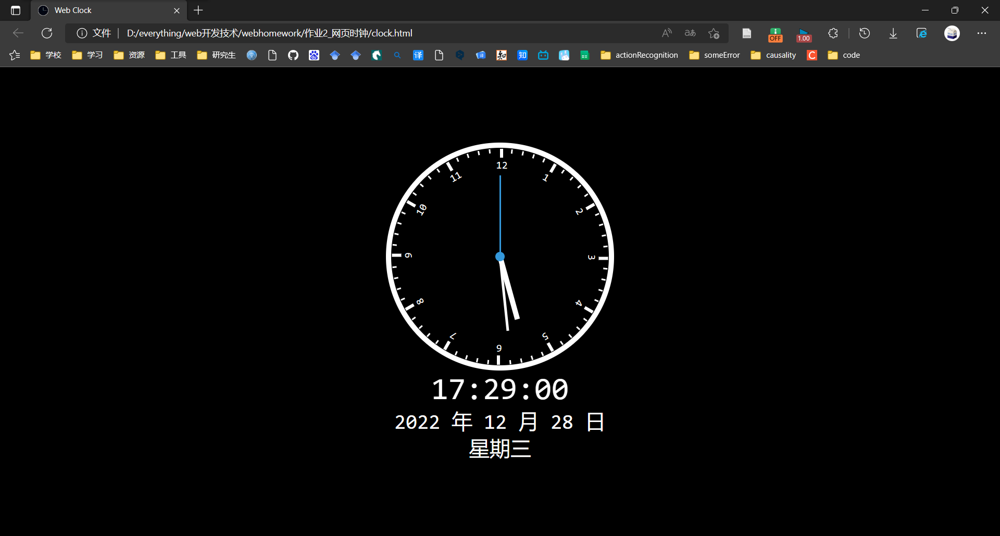

# 作业2_网页时钟

运行结果如下图所示：



## HTML

```html
<!DOCTYPE html>
<html lang="en">
<head>
	<meta charset="UTF-8">
	<meta name="viewport" content="width=device-width, initial-scale=1.0">
	<!-- 设置标题 -->
	<title>Web Clock</title>
	<!-- 外联样式 -->
	<link rel="stylesheet" type="text/css" href="css/clock.css">
	<!-- 设置标签页上的图标 -->
	<link rel="icon" href="src/clock.png">
</head>
<body>
	<!-- 时钟盒子 -->
	<div class="clock">
		<!-- 定义刻度盘，将在js文件中创建li标签来生成刻度 -->
		<ul id="dial"></ul>
        <ul id="num"></ul>
		<!-- 定义时针 -->
		<div class="hour">
			<div class="hr" id="hr"></div>
		</div>
		<!-- 定义分针 -->
		<div class="minute">
			<div class="min" id="min"></div>
		</div>
		<!-- 定义秒针 -->
		<div class="second">
			<div class="sec" id="sec"></div>
		</div>
	</div>
	<!-- 显示当天时间信息的盒子 -->
	<div id="daymsg">
		<div id="hrmsg"></div>
		<div id="minmsg"></div>
		<div id="secmsg"></div>
	</div>
	<!-- 显示年月日的盒子 -->
	<div id="fullmsg">
		<div id="yearmsg"></div>
		<div id="monthmsg"></div>
		<div id="datemsg"></div>
	</div>
	<!-- 显示星期几的盒子 -->
	<div id="weekmsg"></div>
</body>
<!-- 导入js文件 -->
<script src="js/clock.js"></script>
</html>
```

## CSS

```css
*{
	margin: 0;
	padding: 0;
	box-sizing: border-box;
	font-family: consolas;
}
body{
	display: flex;
	justify-content: center;
	align-items: center;
	flex-direction: column;
	min-height: 100vh;
	background: #000000;
}
.clock{
	width: 350px;
	height: 350px;
	display: flex;
	justify-content: center;
	align-items: center;
	border: 8px solid #ffffff;
	border-radius: 50%;
}
.clock::before{
	content: "";
	position: absolute;
	width: 15px;
	height: 15px;
	background: #3498db;
	z-index: 10000;
	border-radius: 50%;
}
li{
	list-style: none;
}
#dial{   
    width: 0px;
    height: 332px; 
}
#num{   
    width: 0px;
    height: 332px; 
}
li{   
    width: 2px;
    height: 6px;
    background: #ffffff;
    display: flex;
    position:absolute;
    justify-content: center;
    align-items: center;
    -webkit-transform-origin: 0 166px;
}
/* 设置5个刻度 */
li:nth-child(1){ -webkit-transform: rotate(0deg);}
li:nth-child(2){ -webkit-transform: rotate(6deg);}
li:nth-child(3){ -webkit-transform: rotate(12deg);}
li:nth-child(4){ -webkit-transform: rotate(18deg);}
li:nth-child(5){ -webkit-transform: rotate(24deg);}
li:nth-of-type(5n+1){
	height: 14px;
	width: 5px;
}
.hour,.minute,.second{
	position: absolute;
}
.hour,.hr{
	width: 200px;
	height: 200px;
}
.minute,.min{
	width: 230px;
	height: 230px;
}
.second,.sec{
	width: 250px;
	height: 250px;
}
.hr,.min,.sec{
	display: flex;
	justify-content: center;
	position: absolute;
}
.hr::before{
	content: '';
	position: absolute;
	width: 8px;
	height: 100px;
	background: #ffffff;
}
.min::before{
	content: '';
	position: absolute;
	width: 4px;
	height: 110px;
	background: #ffffff;
}
.sec::before{
	content: '';
	position: absolute;
	width: 2px;
	height: 120px;
	background: #3498db;
}
#daymsg{
	display: flex;
	color: #ffffff;
	font-size: 3em;
}
#fullmsg{
	display: flex;
	color: #ffffff;
	font-size: 2em;
}
#weekmsg{
	display: flex;
	color: #ffffff;
	font-size: 2em;
}
```

## JavaScript

```javascript
// 以下变量是为了得到时分秒，年月日，星期几的标签元素
const hr = document.querySelector("#hr");
const min = document.querySelector("#min");
const sec = document.querySelector("#sec");
const hrsmg = document.querySelector("#hrmsg");
const minmsg = document.querySelector("#minmsg");
const secmsg = document.querySelector("#secmsg");
const yearmsg = document.querySelector("#yearmsg");
const monthmsg = document.querySelector("#monthmsg");
const datemsg = document.querySelector("#datemsg");
const weekmsg = document.querySelector("#weekmsg");

// 起连接字符串作用
var weekstring;
// 使用setInterval函数，使以下函数每一秒钟运行一次，来达到时钟按秒运行的效果
setInterval(()=>{
    // 声明Date变量，得到需要的时间信息
    let day = new Date();
    let hh = day.getHours();
    let mm = day.getMinutes();
    let ss = day.getSeconds();
    let ww = day.getDay();
    let year = day.getFullYear();
    let month = day.getMonth();
    let date =day.getDate();
    switch(ww){
        case 0:weekstring="星期日";break;
        case 1:weekstring="星期一";break;
        case 2:weekstring="星期二";break;
        case 3:weekstring="星期三";break;
        case 4:weekstring="星期四";break;
        case 5:weekstring="星期五";break;
        case 6:weekstring="星期六";break;
        default:break;
    }
    // 根据得到的时分秒对时针，分钟和秒针进行旋转
    hr.style.transform = `rotateZ(${hh*30+(mm/2)}deg)`;
    min.style.transform = `rotateZ(${mm*6}deg)`;
    sec.style.transform = `rotateZ(${ss*6}deg)`;
    if(hh<10){hh = "0"+hh};
    if(mm<10){mm = "0"+mm};
    if(ss<10){ss = "0"+ss};
    // 连接字符串显示年月日
    hrsmg.innerHTML = hh + ":";
    minmsg.innerHTML = mm + ":";
    secmsg.innerHTML = ss;
    yearmsg.innerHTML = year + "&nbsp年";
    monthmsg.innerHTML = '&nbsp' + (month + 1) + "&nbsp月";
    datemsg.innerHTML = '&nbsp'+ date + "&nbsp日";
    weekmsg.innerHTML = weekstring;
})
// 显示刻度
// 先获取表盘ul1
var dul = document.getElementById('dial');
// 因为是60个刻度，我们就创建60个li，并设置它们的旋转角度
for (let i=0;i<60;i++){
   let dli = document.createElement('li');
   // 因为i是从0~60，而每个刻度的旋转角度360°÷60=6°，所以每个刻度的旋转角度就是i*6°
   dli.style.webkitTransform = 'rotate('+ i*6 +'deg)';
   dul.appendChild(dli);
}
// 设置表盘时点数
var numul = document.getElementById('num');
for (let i=1;i<13;i++){
    let numli = document.createElement('li');
    numli.style.webkitTransform = 'rotate('+ i*30.1 +'deg)';
    // numli.style.backgroundColor = rgba(255, 255, 255, 0.5);
    // numli.style.opacity = 0.3
    numli.style.color = "#ffffff";
    numli.style.width = "0px";
    numli.style.height = "50px";
    numli.textContent = i;
    numul.appendChild(numli);
 }
```
