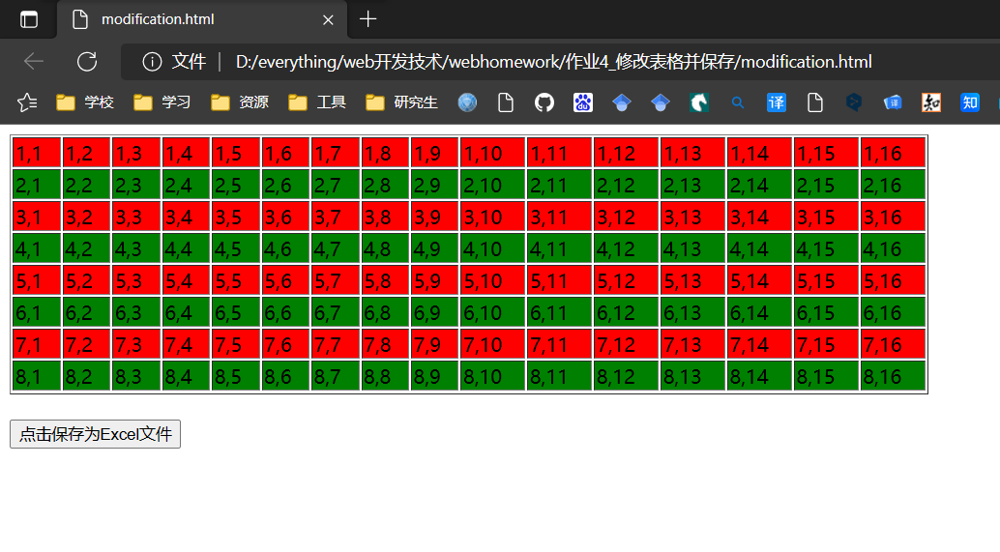
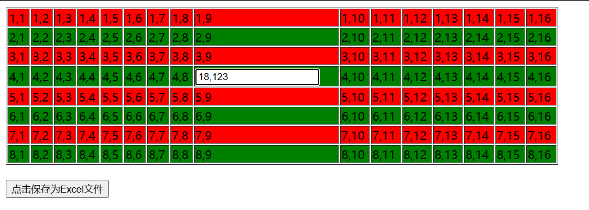
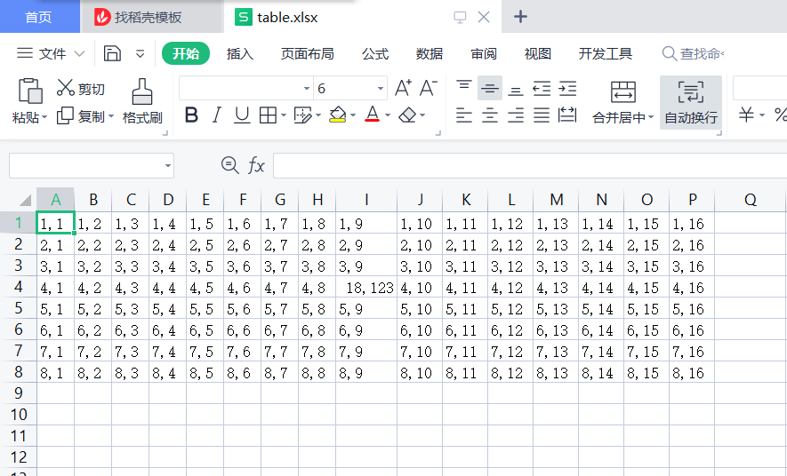

# 作业4_修改表格并保存

使用老师所给的生成table标签与数据的代码继续完成。

运行结果如下图所示：







## HTML

```html
<!DOCTYPE html>
<html>
    <head>
        <title></title>
        <script src="js/jquery-2.1.4.min.js"></script>
        <script src="js/jquery.table2excel.js"></script>
        <script type="text/javascript">
            $(function () {
                $("table tr:nth-child(even)").addClass("alternateColor1");
                $("table tr:nth-child(odd)").addClass("alternateColor2");
            });
        </script>
        <style type="text/css">
            .alternateColor1 {
                background-color: red;
            }
            .alternateColor2 {
                background-color: green;
            }
        </style>
    </head>
    <body>
        <table border="1" style="width: 50%">
            <script>
                // 动态生成8行16列表格
                let rows = 8; cols = 16;
                let mycolor;
                for (let i = 1; i <= rows; i++) {               
                    mycolor = "red";
                    if (i % 2 == 0) mycolor = "green";
                        document.write("<tr style='background-color:" + mycolor + "'>");
                    for (let j = 1; j <= cols; j++) {
                        document.write("<td>" + i + "," + j + "</td>");
                    }
                    document.write("</tr>");
                }
            </script>
        </table>
        <br>
        <button onclick="saveExcel()">点击保存为Excel文件</button>
    </body>
</html>

<script>
    $('table tr td').click(function(){
        let oldVal = $(this).text();
        let tdwidth = $(this).width()
        let input = "<input type='text' id='tmpId' width='" + tdwidth + "' value='" + oldVal + "' >";//创建一个input
        console.log(input)
        let tr = $(this).closest('tr');
        let id = $(tr).children('td').eq(1).text();//获得当前这一行的id
        $(this).text('');
        $(this).append(input);//把input塞进去
        $('#tmpId').focus();
        $('#tmpId').blur(function(){
            if($(this).val() != '' && oldVal != $(this).val()){
               oldVal = $(this).val();
            }
            $(this).closest('td').text(oldVal);
        });
    });
    function saveExcel(){
        console.log("saveExcel")
        $("table").table2excel({
            //不被导出表格行的class类
            exclude: "",
            //文档名称
            name: "table.xlsx",
            //文件名称
            filename: "table.xlsx",
            //是否导出图片
            exclude_img: false,
            //是否导出超链接
            exclude_links: false,
            //是否导出input框中的内容
            exclude_inputs: false
        });
    };
</script>
```

## JavaScript

代码见：作业4_修改表格并保存\js
