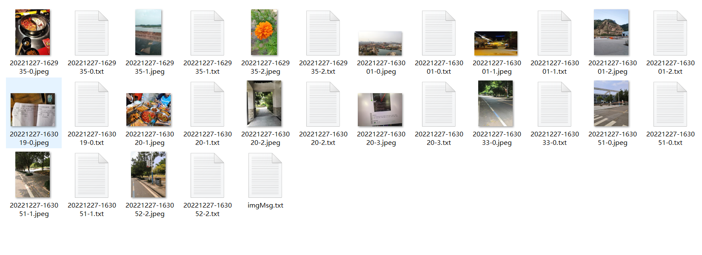

# 作业6_图片浏览器

## 系统组成

图片浏览器系统由两部分组成：

client前端：基于VUE，结合ElementUI组件进行开发

server后端：基于Java开发

## 系统功能

图片浏览器系统主要实现了以下几个功能：

1. 用户与管理员信息注册与登录
2. 浏览所有图片
3. 根据图片分类进行查看
4. 上传图片
5. 对图片进行管理

## 代码与效果展示

### 用户注册功能

页面运行效果如下：


client端：

```html
<el-card class="box-card">
            <div slot="header" class="clearfix">
                <span class="title"> 添加用户</span>
            </div>
            <div class="form-database-form">
                <el-form :model="form" ref="formModel" label-width="130px" status-icon validate-on-rule-change>
                    <el-form-item
                        label="用户名"
                        prop="yonghuming"
                        required
                        :rules="[{required:true, message:'请填写用户名'}, {validator:rule.checkRemote, message:'内容重复了', checktype:'insert', module:'yonghu', col:'yonghuming', trigger:'blur'}]"
                    >
                        <el-input type="text" placeholder="输入用户名" style="width: 250px" v-model="form.yonghuming" />
                    </el-form-item>

                    <el-form-item label="密码" prop="mima" required :rules="[{required:true, message:'请填写密码'}]">
                        <el-input type="password" placeholder="输入密码" style="width: 250px" v-model="form.mima" />
                    </el-form-item>

                    <el-form-item label="姓名" prop="xingming" required :rules="[{required:true, message:'请填写姓名'}]">
                        <el-input type="text" placeholder="输入姓名" style="width: 250px" v-model="form.xingming" />
                    </el-form-item>

                    <el-form-item label="性别" prop="xingbie">
                        <el-select v-model="form.xingbie"
                            ><el-option label="男" value="男"></el-option>
                            <el-option label="女" value="女"></el-option>
                        </el-select>
                    </el-form-item>

                    <el-form-item label="手机" prop="shouji" :rules="[{validator:rule.checkPhone, message:'请输入正确手机号码'}]">
                        <el-input type="text" placeholder="输入手机" style="width: 250px" v-model="form.shouji" />
                    </el-form-item>

                    <el-form-item label="邮箱" prop="youxiang" :rules="[{type:'email', message:'请输入正确邮箱地址'}]">
                        <el-input type="text" placeholder="输入邮箱" style="width: 250px" v-model="form.youxiang" />
                    </el-form-item>

                    <el-form-item label="头像" prop="touxiang" required :rules="[{required:true, message:'请填写头像'}]">
                        <e-upload-image v-model="form.touxiang"></e-upload-image>
                    </el-form-item>

                    <el-form-item v-if="btnText">
                        <el-button type="primary" @click="submit">{{ btnText }}</el-button>
                    </el-form-item>
                </el-form>
            </div>
        </el-card>
```

```javascript

this.$post(api.yonghu.insert, form)
                            .then((res) => {
                                this.loading = false;
                                if (res.code == api.code.OK) {
                                    this.$message.success("添加成功");
                                    this.$emit("success", res.data);
                                    this.$refs.formModel.resetFields();
                                    this.loadInfo();
                                } else {
                                    this.$message.error(res.msg);
                                }
                            })
                            .catch((err) => {
                                this.loading = false;
                                this.$message.error(err.message);
                            });
```

server端：

```java
@RequestMapping("/yonghuinsert")
    public String insert() {
        _var = new LinkedHashMap(); // 重置数据
        String tmp = "";
        Yonghu post = new Yonghu(); // 创建实体类
        // 设置前台提交上来的数据到实体类中
        post.setYonghuming(Request.get("yonghuming"));
        post.setMima(Request.get("mima"));
        post.setXingming(Request.get("xingming"));
        post.setXingbie(Request.get("xingbie"));
        post.setShouji(Request.get("shouji"));
        post.setYouxiang(Request.get("youxiang"));
        post.setTouxiang(Request.get("touxiang"));
        service.insert(post); // 插入数据
        int charuid = post.getId().intValue();
        if (isAjax()) {
            return jsonResult(post);
        }
        return showSuccess("保存成功", Request.get("referer").equals("") ? request.getHeader("referer") : Request.get("referer"));
    }
```

### 用户登录功能

页面运行效果如下：


client端：

```html
<form action="javascript:;" :autocomplete="false">
                <div class="loginform clearfix">
                    <div class="loginform_row">
                        <label for="username">账号:</label>
                        <input type="text" id="username" :autocomplete="false" class="loginform_input" v-model="form.username" placeholder="输入账号" name="username" />
                    </div>
                    <div class="loginform_row">
                        <label for="password">密码:</label>
                        <input type="password" id="password" :autocomplete="false" class="loginform_input" v-model="form.pwd" placeholder="输入密码" name="password" />
                    </div>
                    <div class="loginform_row random">
                        <label>验证码:</label>
                        <input type="text" class="loginform_input" v-model="form.pagerandom" placeholder="输入验证码" name="" />
                        <e-img alt="刷新验证码" title="点击刷新验证码" class="ramdom-img" @click="loadCaptch" :src="captchUrl" style=""></e-img>
                    </div>
                    <div class="loginform_row role">
                        <label>角色:</label>
                        <div class="loginform_input">
                            <el-radio-group v-model="form.cx" size="mini">
                                <el-radio-button v-for="r in rules" :key="r" :label="r" size="mini"></el-radio-button>
                            </el-radio-group>
                        </div>
                    </div>
                    <div class="loginform_row" style="text-align: right">
                        <input type="submit" class="loginform_submit" @click="login" value="登录" />
                    </div>
                    <div class="clear"></div>
                </div>
            </form>
```

```javascript
login() {
                this.loading = true;
                this.$store
                    .dispatch("user/login", this.form)
                    .then((res) => {
                        this.loading = false;
                        if (res.code == api.code.OK) {
                            this.$message.success("登录成功");
                            var redirect = this.$route.query.redirect;
                            if (redirect) {
                                this.$router.replace(redirect);
                            } else {
                                this.$router.replace("/admin/sy");
                            }
                        } else {
                            this.$message.error(res.msg);
                        }
                        if (res.code == 20) {
                            this.loadCaptch();
                        }
                    })
                    .catch((err) => {
                        this.loading = false;
                        this.$message.error(err.message);
                    });
            },
```

server端：

```java
protected String authLoginUser(boolean isAdmin, String username, String pwd, String cx) {
        if (username == null || "".equals(username)) {
            return showError("账号不允许为空");
        }
        if (pwd == null || "".equals(pwd)) {
            return showError("密码不允许为空");
        }
        if (cx == null) {
            return showError("请选中登录类型");
        }
        String random;
        // 获取 token方式的验证码值
        if (isAjax() && request.getParameter("captchToken") != null) {
            random = DESUtil.decrypt("CaptchControllerPassword", request.getParameter("captchToken"));
        } else {
            random = (String) request.getSession().getAttribute("random");
        }
        String pagerandom = request.getParameter("pagerandom") == null ? "" : request.getParameter("pagerandom");
        if (request.getParameter("a") != null && !pagerandom.equals(random)) {
            return showError("验证码不正确", 20);
        }
        String table = "";

        if (cx.equals("管理员")) {
            table = "admins";
            Admins user = adminsService.login(username, pwd);
            if (user == null) {
                return showError("用户名或密码错误");
            }
            session.setAttribute("id", user.getId());
            session.setAttribute("username", user.getUsername());
            session.setAttribute("cx", cx);
            session.setAttribute("login", cx);
            session.setAttribute("username", user.getUsername());
            session.setAttribute("pwd", user.getPwd());
            JSONObject jsonObject = JSON.parseObject(JSON.toJSONString(user));
            jsonObject.put("cx", session.getAttribute("cx"));
            jsonObject.put("username", session.getAttribute("username"));
            jsonObject.put("login", session.getAttribute("login"));
            assign("session", jsonObject);
        }
        if (cx.equals("用户")) {
            table = "yonghu";
            Yonghu user = yonghuService.login(username, pwd);
            if (user == null) {
                return showError("用户名或密码错误");
            }
            session.setAttribute("id", user.getId());
            session.setAttribute("username", user.getYonghuming());
            session.setAttribute("cx", cx);
            session.setAttribute("login", cx);
            session.setAttribute("yonghuming", user.getYonghuming());
            session.setAttribute("mima", user.getMima());
            session.setAttribute("xingming", user.getXingming());
            session.setAttribute("xingbie", user.getXingbie());
            session.setAttribute("shouji", user.getShouji());
            session.setAttribute("youxiang", user.getYouxiang());
            session.setAttribute("touxiang", user.getTouxiang());
            JSONObject jsonObject = JSON.parseObject(JSON.toJSONString(user));
            jsonObject.put("cx", session.getAttribute("cx"));
            jsonObject.put("username", session.getAttribute("username"));
            jsonObject.put("login", session.getAttribute("login"));
            assign("session", jsonObject);
        }

        if (session.getAttribute("username") == null) {
            return showError("账号或密码错误");
        }

        assign("token", createToken(table, session.getAttribute("id"), session.getAttribute("cx"), session.getAttribute("login"), session.getAttribute("username")));

        if (this.isAjax()) {
            return json();
        } else {
            String referer = request.getParameter("referer");
            if (referer == null) {
                if (isAdmin) {
                    referer = "./main.do";
                } else {
                    referer = "./";
                }
            }
            return showSuccess("登录成功", referer);
        }
    }
```

### 照片显示功能

页面运行效果如下：


client端：

```html
<div v-loading="loading">
        <div>
            <e-container>
                <el-carousel indicator-position="outside" height="480px">
                    <el-carousel-item v-for="item in bhtList" :key="item.id">
                        <div style="background-size: cover" @click="$goto(item.url)" :style="{'background-image': 'url('+item.image+')',width:'100%', height: '480px'}"></div>
                    </el-carousel-item>
                </el-carousel>
            </e-container>
        </div>
        <div>
            <e-container>
                <e-module-model-box>
                    <div class="floor_goods_wrap clearfix">
                        <el-row :gutter="20">
                            <el-col :md="6" v-for="r in zhaopianxinxilist1">
                                <div class="floor_goods_wrap_li">
                                    <div class="floor_goods_wrap_b">
                                        <router-link :to="{path:'/zhaopianxinxidetail',query:{id:r.id}}" class="floor_goods_img">
                                            <e-img-box :src="r.zhaopian" pb="100"></e-img-box>
                                        </router-link>
                                        <router-link
                                            :to="{path:'/zhaopianxinxidetail',query:{id:r.id}}"
                                            class="floor_goods_tit"
                                            v-html="$substr(r.zhaopianmingcheng,20)"
                                        ></router-link>
                                        <router-link
                                            :to="{path:'/zhaopianxinxidetail',query:{id:r.id}}"
                                            class="floor_goods_txt"

                                        ></router-link>
                                    </div>
                                </div>
                            </el-col>
                        </el-row>
                    </div>
                </e-module-model-box>
            </e-container>
        </div>
    </div>
```

```javascript
loadPageData() {
                if (this.loading) return;
                this.loading = true;
                this.$get("/index")
                    .then((res) => {
                        this.loading = false;
                        if (res.code == api.code.OK) {
                            console.log(res.data)
                            extend(this, res.data);
                        } else {
                            this.$message.error(res.msg);
                        }
                    })
                    .catch((err) => {
                        this.loading = false;
                        this.$message.error(err.message);
                    });
            },
```

server端：

```java
// 首页
    @RequestMapping(value = { "/", "index" })
    public String Index() {
        List<Map> bhtList = Query.make("lunbotu").order("id desc").limit(5).select();
        assign("bhtList", bhtList);

        List<Map> zhaopianxinxilist1 = Query.make("zhaopianxinxi").limit(20).order("id desc").select();
        assign("zhaopianxinxilist1", zhaopianxinxilist1);
        if (isAjax()) {
            return json();
        }
        return "index";
    }
```

### 上传照片功能

页面运行效果如下：




client端：

```html
<el-button type="primary" round @click="updateCSV()">点击上传</el-button>
    <br><br><br>
    <el-upload class="upload-demo"
        action="#"
        :http-request="httpRequest"
        :on-success="handleAvatarSuccess"
        :on-remove="handleRemove"
        :on-preview="handlePreview"
        :on-change="handleChange"
        :before-remove="beforeRemove"
        multiple>
        <el-button size="small" type="primary">选择图片</el-button>
        <div style="display:none">
            
        </div>
        <div slot="tip" class="el-upload__tip">只能选择jpg/png文件</div>
    </el-upload>
```

```javascript
handleChange(file, fileList) {
            console.log("handleChange")
            this.img_name = file.name
            this.img_base64 = URL.createObjectURL(file.raw);
            this.uploadImgToBase64(file.raw).then((data) => {
                this.img_base64 = data.result;
            });
            let picdic = {}
            picdic["name"] = this.img_name
            picdic["base64"] = this.img_base64
            this.img_msg.push(picdic)
        }

uploadImgToBase64(file) {
            // 核心方法，将图片转成base64字符串形式
            return new Promise((resolve, reject) => {
                const reader = new FileReader();
                reader.readAsDataURL(file);
                reader.onload = function () {
                    // 图片转base64完成后返回reader对象
                    resolve(reader);
                };
                reader.onerror = reject;
            });
        }
```

server端：

```python
@app.route('/updateImgData', methods=['POST'])
def updateImgData():
    picDir = "pic/"
    for i in range(len(request.json)):
        img64_arg = request.json[i]["img_base64"].split(",")
        # 获得图片文件类型
        imgtype = img64_arg[0].split(";")[0]
        imgtype = imgtype.split("/")[-1]
        # 获得图片的base64
        img64 = img64_arg[1]
        # 根据当前的系统时间对图片进行命名
        timestr = time.strftime("%Y%m%d-%H%M%S")
        imgname = timestr + "-" + str(i)
        # 保存图片
        imgname = picDir + imgname
        imgfile = open(imgname + "." + imgtype, 'wb')
        imgfile.write(base64.b64decode(img64))
        imgfile.close()
        # 保存完整base64
        imgtxt = open(imgname + '.txt', 'wt')
        imgtxt.write(request.json[i]["img_base64"])
        imgtxt.close()
        # 读取图片的exif信息
        f = open(imgname + "." + imgtype, 'rb')
        tags = exifread.process_file(f)
        imgtime = tags['EXIF DateTimeOriginal']
        imgtime = str(imgtime)
        lat = getLatOrLng('GPS GPSLatitudeRef', 'GPS GPSLatitude', tags)  # 纬度
        lng = getLatOrLng('GPS GPSLongitudeRef', 'GPS GPSLongitude', tags)  # 经度
        location = getlocation(str(lat), str(lng))
        print('位置：{0}'.format(location))
        df = cpca.transform([str(location)])
        # 保存图片exif信息 imgMsg文件为保存上传图片的拍摄时间、地点、名称的信息
        imgMsgTxt = open('pic/imgMsg.txt', 'a')
        imgDir = imgname + "." + imgtype
        imgMsgTemp = imgDir+"&"+imgtime+"&"+df.iat[0, 0]+"&"+df.iat[0, 1]+"&"+df.iat[0, 2]+"&"+df.iat[0, 3]+"\n"
        imgMsgTxt.write(imgMsgTemp)
        imgMsgTxt.close()
    return "上传图片成功"
```

### 提取照片EXIF信息功能

页面运行效果如下：


client端：

```javascript
getImgLocation(file){
            console.log("getImgLocation")
            let _this = this
            let imgtemp = this.$refs.refimg
            EXIF.getData(imgtemp,function(){
                //图片包含的所有信息(例：拍照方向、相机设备型号、拍摄时间、ISO 感光度、GPS 地理位置等数据。)
                const imgAllInfo = EXIF.getAllTags(this);
                const shootTime = EXIF.getTag(this, 'DateTime')
                const imgLon = EXIF.getTag(this, 'GPSLongitude')
                const imgLat = EXIF.getTag(this, 'GPSLatitude')
                console.log(shootTime)
                // console.log(imgLon)
                // console.log(imgLat)
                if(imgLon && imgLat){
                    //计算出经纬度并保留6为小数
                    const lon = (imgLon[0] + imgLon[1]/60 + imgLon[2]/60/60).toFixed(6)
                    const lat = (imgLat[0] + imgLat[1]/60 + imgLat[2]/60/60).toFixed(6)
                    //使用高德地图的逆地理编码，key申请类型为Web API服务
                    const mapKey = '2091516000af8dacde13790ec768f934'
                    //调用高德API
                    axios.get(`https://restapi.amap.com/v3/geocode/regeo?key=${mapKey}&location=${lon},${lat}`).then(res=>{
                        _this.address = res.data.regeocode.formatted_address
                    })
                } else {
                    _this.address = '暂未获得该图片地址'
                }
                console.log(_this.address)
                let reg = /.+?(省|市|自治区|自治州|县|区)/g;
                console.log(_this.address.match(reg));
            })
  
```

server端：

```python
@app.route('/updateImgData', methods=['POST'])
def updateImgData():
    picDir = "pic/"
    for i in range(len(request.json)):
        img64_arg = request.json[i]["img_base64"].split(",")
        # 获得图片文件类型
        imgtype = img64_arg[0].split(";")[0]
        imgtype = imgtype.split("/")[-1]
        # 获得图片的base64
        img64 = img64_arg[1]
        # 根据当前的系统时间对图片进行命名
        timestr = time.strftime("%Y%m%d-%H%M%S")
        imgname = timestr + "-" + str(i)
        # 保存图片
        imgname = picDir + imgname
        imgfile = open(imgname + "." + imgtype, 'wb')
        imgfile.write(base64.b64decode(img64))
        imgfile.close()
        # 保存完整base64
        imgtxt = open(imgname + '.txt', 'wt')
        imgtxt.write(request.json[i]["img_base64"])
        imgtxt.close()
        # 读取图片的exif信息
        f = open(imgname + "." + imgtype, 'rb')
        tags = exifread.process_file(f)
        imgtime = tags['EXIF DateTimeOriginal']
        imgtime = str(imgtime)
        lat = getLatOrLng('GPS GPSLatitudeRef', 'GPS GPSLatitude', tags)  # 纬度
        lng = getLatOrLng('GPS GPSLongitudeRef', 'GPS GPSLongitude', tags)  # 经度
        location = getlocation(str(lat), str(lng))
        print('位置：{0}'.format(location))
        df = cpca.transform([str(location)])
        # 保存图片exif信息 imgMsg文件为保存上传图片的拍摄时间、地点、名称的信息
        imgMsgTxt = open('pic/imgMsg.txt', 'a')
        imgDir = imgname + "." + imgtype
        imgMsgTemp = imgDir+"&"+imgtime+"&"+df.iat[0, 0]+"&"+df.iat[0, 1]+"&"+df.iat[0, 2]+"&"+df.iat[0, 3]+"\n"
        imgMsgTxt.write(imgMsgTemp)
        imgMsgTxt.close()
    return "上传图片成功"
```

### 照片详情功能

页面运行效果如下：


client端：

```html
<div class="zhaopianxinxi-detail" v-loading="loading" ref="print">
        <el-page-header @back="goBack" content="详情页面"></el-page-header>
        <div class="admin-detail">
            <div class="detail detail-text">
                <div class="detail-title">照片编号：</div>
                <div class="detail-content">{{ map.zhaopianbianhao }}</div>
            </div>
            <div class="detail detail-text">
                <div class="detail-title">拍摄地点：</div>
                <div class="detail-content">{{ map.paishedidian }}</div>
            </div>
            <div class="detail detail-longtext">
                <div class="detail-title">照片名称：</div>
                <div class="detail-content">{{ map.zhaopianmingcheng }}</div>
            </div>
            <div class="detail detail-select">
                <div class="detail-title">分类：</div>
                <div class="detail-content">
                    <e-select-view module="zhaopianfenlei" :value="map.fenlei" select="id" show="fenleimingcheng"></e-select-view>
                </div>
            </div>
            <div class="detail detail-datetime">
                <div class="detail-title">拍摄时间：</div>
                <div class="detail-content">{{ map.paisheshijian }}</div>
            </div>
            <div class="detail detail-textarea">
                <div class="detail-title">照片简介：</div>
                <div class="detail-content">{{ map.zhaopianjianjie }}</div>
            </div>
            <div class="detail detail-textuser">
                <div class="detail-title">发布人：</div>
                <div class="detail-content">{{ map.faburen }}</div>
            </div>
            <div class="detail detail-images">
                <div class="detail-title">照片：</div>
                <div class="detail-content">
                    <e-images :src="map.zhaopian" type="detail"></e-images>
                </div>
            </div>
        </div>
        <div class="mt10">
            <el-button type="default" class="hidePrint" @click="$router.go(-1)"> 返回 </el-button>
            <el-button type="success" class="hidePrint" @click="$print"> 打印本页 </el-button>
        </div>
    </div>
```

```javascript
loadDetail() {
                if (this.loading) return;
                this.loading = true;
                this.$get(api.zhaopianxinxi.detail, {
                    id: this.id,
                })
                    .then((res) => {
                        this.loading = false;
                        if (res.code == api.code.OK) {
                            extend(this, res.data);
                        } else {
                            this.$message.error(res.msg);
                        }
                    })
                    .catch((err) => {
                        this.loading = false;
                        this.$message.error(err.message);
                    });
            }
```

server端：

```java
@RequestMapping("/zhaopianxinxi_detail")
    public String detail() {
        _var = new LinkedHashMap(); // 重置数据
        int id = Request.getInt("id");
        Zhaopianxinxi map = service.find(id); // 根据前台url 参数中的id获取行数据
        assign("map", map); // 把数据写到前台
        return json(); // 将数据写给前端
    }
```

### 照片筛选功能

页面运行效果如下：


client端：

```html
<el-cascader 
                    class="cascader-style"
                    v-model="result.value"
                    :options="result.options"
                    @change="handleChange">
                </el-cascader>
                <el-cascader 
                    class="cascader-style"
                    v-model="imgtime.value"
                    :options="imgtime.options"
                    @change="handleChange">
                </el-cascader>
```

```javascript
initImgList(){
            const path = api.prdpath + "/getImgList"
            this.$api.get(path, null, response=>{
                if (response.status >= 200 && response.status < 300) {
                    this.result.options = response.data.location
                    this.imgtime.options = response.data.time
                    this.$message.success("请求成功")
                } else {
                    this.$message.error("请求失败")
                }
            })
        },
```

server端：

```python
@app.route('/getAllImg', methods=['GET'])
def getAllImg():
    imgMsgTxt = open('pic/imgMsg.txt', 'r')
    allLines = imgMsgTxt.readlines()
    imgMsgTxt.close()
    img_Msg = {}
    skipProvince = []
    skipCity = []
    skipRegion = []
    provinceList = []
    timeList = []
    timeTempItem = ""
    timeTemp = []
    for line in allLines:
        img_temp = line.split("&")
        # 生成照片的级联选择器所需要的数据格式
        timeTempItem = img_temp[1].split(" ")[0]
        # timeTempItem = timeTempItem.replace(":", "-")
        timeTemp.append(timeTempItem)
        # 生成照片位置的级联选择器需要的数据格式
        regionList = []
        cityList = []
        if img_temp[2] not in skipProvince:
            skipProvince.append(img_temp[2])
            skipCity.append(img_temp[3])
            skipRegion.append(img_temp[4])
            regionList.append({
                "value": img_temp[4],
                "label": img_temp[4]
            })
            cityList.append({
                "value": img_temp[3],
                "label": img_temp[3],
                "children": regionList
            })
            provinceList.append({
                "value": img_temp[2],
                "label": img_temp[2],
                "children": cityList
            })
        else:
            if img_temp[3] not in skipCity:
                skipCity.append(img_temp[3])
                skipRegion.append(img_temp[4])
                regionList.append({
                    "value": img_temp[4],
                    "label": img_temp[4]
                })
                cityDict = {
                    "value": img_temp[3],
                    "label": img_temp[3],
                    "children": regionList
                }
                for i in range(len(provinceList)):
                    if provinceList[i]["value"] == img_temp[2]:
                        provinceList[i]["children"].append(cityDict)
            else:
                if img_temp[4] not in skipRegion:
                    skipRegion.append(img_temp[4])
                    regionDict = {
                        "value": img_temp[4],
                        "label": img_temp[4]
                    }
                    for i in range(len(provinceList)):
                        if provinceList[i]["value"] == img_temp[2]:
                            tempList = provinceList[i]["children"]
                            for j in range(len(tempList)):
                                if tempList[j]["value"] == img_temp[3]:
                                    tempList[j]["children"].append(regionDict)
    img_Msg["location"] = provinceList
    print(provinceList)
    timeTemp = set(timeTemp)
    timeTemp = sorted(timeTemp, key=lambda x: datetime.strptime(x, "%Y:%m:%d"))
    for i in range(len(timeTemp)):
        timeDict = {
            "value": timeTemp[i],
            "label": timeTemp[i]
        }
        timeList.append(timeDict)
    img_Msg["time"] = timeList
    print(timeList)
    return img_Msg
```

### 照片管理功能


页面运行效果如下：

client端：

```html
<el-card class="box-card">
            <div slot="header" class="clearfix updt">
                <el-page-header @back="$router.go(-1)" content="编辑照片信息"> </el-page-header>
            </div>
            <div class="form-database-form">
                <el-form :model="form" ref="formModel" label-width="130px" status-icon validate-on-rule-change>
                    <el-form-item label="照片编号" prop="zhaopianbianhao" :rules="[{required:true, message:'请填写照片编号'}]">
                        <el-input type="text" placeholder="输入照片编号" style="width: 250px" v-model="form.zhaopianbianhao" />
                    </el-form-item>

                    <el-form-item label="照片名称" prop="zhaopianmingcheng" required :rules="[{required:true, message:'请填写照片名称'}]">
                        <el-input type="text" placeholder="输入照片名称" style="width: 450px" v-model="form.zhaopianmingcheng" />
                    </el-form-item>

                    <el-form-item label="分类" prop="fenlei" required :rules="[{required:true, message:'请填写分类'}]">
                        <el-select v-model="form.fenlei"><e-select-option type="option" module="zhaopianfenlei" value="id" label="fenleimingcheng"></e-select-option></el-select>
                    </el-form-item>

                    <el-form-item label="照片" prop="zhaopian" required :rules="[{required:true, message:'请填写照片'}]">
                        <e-upload-images v-model="form.zhaopian"></e-upload-images>
                    </el-form-item>

                    <el-form-item label="拍摄时间" prop="paisheshijian" required :rules="[{required:true, message:'请填写拍摄时间'}]">
                        <el-date-picker v-model="form.paisheshijian" type="datetime" :editable="false" value-format="yyyy-MM-dd HH:mm:ss" placeholder="选择日期"> </el-date-picker>
                    </el-form-item>

                    <el-form-item label="拍摄地点" prop="paishedidian" required :rules="[{required:true, message:'请填写拍摄地点'}]">
                        <el-input type="text" placeholder="输入拍摄地点" style="width: 250px" v-model="form.paishedidian" />
                    </el-form-item>

                    <el-form-item label="照片简介" prop="zhaopianjianjie" required :rules="[{required:true, message:'请填写照片简介'}]">
                        <el-input type="textarea" v-model="form.zhaopianjianjie"></el-input>
                    </el-form-item>

                    <el-form-item label="发布人" prop="faburen"> <el-input v-model="form.faburen" readonly style="width: 250px"></el-input> </el-form-item>

                    <el-form-item v-if="btnText">
                        <el-button type="primary" @click="submit">{{ btnText }}</el-button>
                    </el-form-item>
                </el-form>
            </div>
        </el-card>
```

```javascript
submit() {
                this.$refs.formModel
                    .validate()
                    .then((res) => {
                        if (this.loading) return;
                        this.loading = true;
                        var form = this.form;

                        this.$post(api.zhaopianxinxi.update, form)
                            .then((res) => {
                                this.loading = false;
                                if (res.code == api.code.OK) {
                                    this.$message.success("添加成功");
                                    this.$emit("success", res.data);
                                    this.$refs.formModel.resetFields();
                                    this.loadInfo();
                                } else {
                                    this.$message.error(res.msg);
                                }
                            })
                            .catch((err) => {
                                this.loading = false;
                                this.$message.error(err.message);
                            });
                    })
                    .catch((err) => {
                        console.log(err.message);
                    });
            },
```

server端：

```java
@RequestMapping("/zhaopianxinxiupdate")
    public String update() {
        _var = new LinkedHashMap(); // 重置数据
        // 创建实体类
        Zhaopianxinxi post = new Zhaopianxinxi();
        // 将前台表单数据填充到实体类
        if (!Request.get("zhaopianbianhao").equals("")) post.setZhaopianbianhao(Request.get("zhaopianbianhao"));
        if (!Request.get("zhaopianmingcheng").equals("")) post.setZhaopianmingcheng(Request.get("zhaopianmingcheng"));
        if (!Request.get("fenlei").equals("")) post.setFenlei(Request.get("fenlei"));
        if (!Request.get("zhaopian").equals("")) post.setZhaopian(Request.get("zhaopian"));
        if (!Request.get("paisheshijian").equals("")) post.setPaisheshijian(Request.get("paisheshijian"));
        if (!Request.get("paishedidian").equals("")) post.setPaishedidian(Request.get("paishedidian"));
        if (!Request.get("zhaopianjianjie").equals("")) post.setZhaopianjianjie(Request.get("zhaopianjianjie"));
        if (!Request.get("faburen").equals("")) post.setFaburen(Request.get("faburen"));

        post.setId(Request.getInt("id"));
        service.update(post); // 更新数据
        int charuid = post.getId().intValue();

        if (isAjax()) {
            return jsonResult(post);
        }

        return showSuccess("保存成功", Request.get("referer")); // 弹出保存成功，并跳转到前台提交的 referer 页面
    }
```
